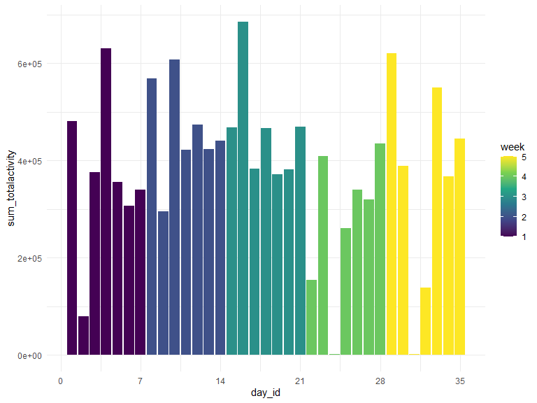
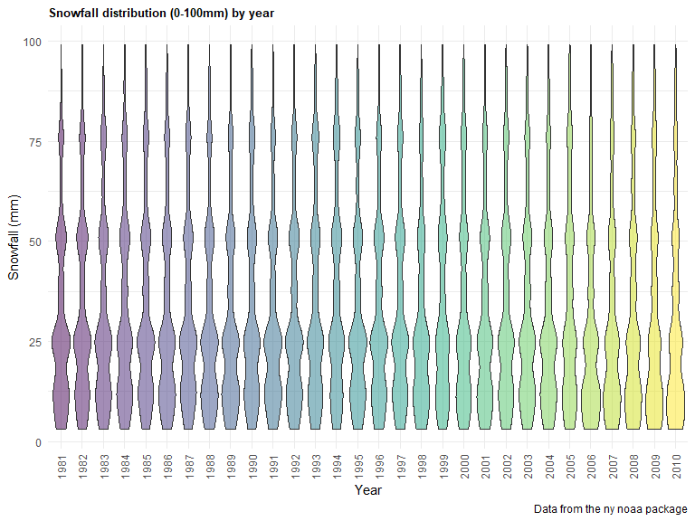

p8105_hw3_as6445
================
Ayako Sekiya
2022-10-07

``` r
library(tidyverse)
```

    ## ── Attaching packages ─────────────────────────────────────── tidyverse 1.3.2 ──
    ## ✔ ggplot2 3.3.6      ✔ purrr   0.3.4 
    ## ✔ tibble  3.1.8      ✔ dplyr   1.0.10
    ## ✔ tidyr   1.2.0      ✔ stringr 1.4.1 
    ## ✔ readr   2.1.2      ✔ forcats 0.5.2 
    ## ── Conflicts ────────────────────────────────────────── tidyverse_conflicts() ──
    ## ✖ dplyr::filter() masks stats::filter()
    ## ✖ dplyr::lag()    masks stats::lag()

``` r
library(ggridges)
library(patchwork)

library(p8105.datasets)

knitr::opts_chunk$set(
    echo = TRUE,
    warning = FALSE,
    fig.width = 8, 
  fig.height = 6,
  out.width = "90%"
)

theme_set(theme_minimal() + theme(legend.position = "bottom"))

options(
  ggplot2.continuous.colour = "viridis",
  ggplot2.continuous.fill = "viridis"
)

scale_colour_discrete = scale_colour_viridis_d
scale_fill_discrete = scale_fill_viridis_d
```

## Problem 1

#### Read into data

``` r
data("instacart")

instacart=
  instacart
```

There are 1384617 observations and 15 columns in the instacart data. The
variables included are as following: order_id, product_id,
add_to_cart_order, reordered, user_id, eval_set, order_number,
order_dow, order_hour_of_day, days_since_prior_order, product_name,
aisle_id, department_id, aisle, department.

Below is a table summarizing the number of items ordered from aisle. In
total, there are 134 aisles, with fresh vegetables and fresh fruits
holding the most items ordered by far.

``` r
instacart %>% 
  count(aisle) %>% 
  arrange(desc(n))
```

    ## # A tibble: 134 × 2
    ##    aisle                              n
    ##    <chr>                          <int>
    ##  1 fresh vegetables              150609
    ##  2 fresh fruits                  150473
    ##  3 packaged vegetables fruits     78493
    ##  4 yogurt                         55240
    ##  5 packaged cheese                41699
    ##  6 water seltzer sparkling water  36617
    ##  7 milk                           32644
    ##  8 chips pretzels                 31269
    ##  9 soy lactosefree                26240
    ## 10 bread                          23635
    ## # … with 124 more rows

``` r
instacart %>% 
  count(aisle) %>% 
  filter(n > 10000) %>% 
  mutate(aisle = fct_reorder(aisle, n)) %>% 
  ggplot(aes(x = aisle, y = n)) + 
  geom_point() + 
  labs(title = "Number of items ordered in each aisle") +
  theme(axis.text.x = element_text(angle = 60, hjust = 1))
```


``` r
instacart %>% 
  filter(aisle %in% c("baking ingredients", "dog food care", "packaged vegetables fruits")) %>%
  group_by(aisle) %>% 
  count(product_name) %>% 
  mutate(rank = min_rank(desc(n))) %>% 
  filter(rank < 4) %>% 
  arrange(desc(n)) %>%
  knitr::kable()
```

| aisle                      | product_name                                  |    n | rank |
|:---------------------------|:----------------------------------------------|-----:|-----:|
| packaged vegetables fruits | Organic Baby Spinach                          | 9784 |    1 |
| packaged vegetables fruits | Organic Raspberries                           | 5546 |    2 |
| packaged vegetables fruits | Organic Blueberries                           | 4966 |    3 |
| baking ingredients         | Light Brown Sugar                             |  499 |    1 |
| baking ingredients         | Pure Baking Soda                              |  387 |    2 |
| baking ingredients         | Cane Sugar                                    |  336 |    3 |
| dog food care              | Snack Sticks Chicken & Rice Recipe Dog Treats |   30 |    1 |
| dog food care              | Organix Chicken & Brown Rice Recipe           |   28 |    2 |
| dog food care              | Small Dog Biscuits                            |   26 |    3 |

``` r
instacart %>%
  filter(product_name %in% c("Pink Lady Apples", "Coffee Ice Cream")) %>%
  group_by(product_name, order_dow) %>%
  summarize(mean_hour = mean(order_hour_of_day)) %>%
  spread(key = order_dow, value = mean_hour) %>%
  knitr::kable(digits = 2)
```

    ## `summarise()` has grouped output by 'product_name'. You can override using the
    ## `.groups` argument.

| product_name     |     0 |     1 |     2 |     3 |     4 |     5 |     6 |
|:-----------------|------:|------:|------:|------:|------:|------:|------:|
| Coffee Ice Cream | 13.77 | 14.32 | 15.38 | 15.32 | 15.22 | 12.26 | 13.83 |
| Pink Lady Apples | 13.44 | 11.36 | 11.70 | 14.25 | 11.55 | 12.78 | 11.94 |

## Problem 2

``` r
accel = 
  read_csv(file = "./data/accel_data.csv") %>% 
  janitor::clean_names() %>% 
  pivot_longer(
    activity_1:activity_1440, 
    names_to = "activity",
    values_to = "activity_count") %>% 
  mutate(day_type= ifelse(day=='Saturday','Weekend',
                   ifelse(day=='Sunday','Weekend','Weekday')))
```

    ## Rows: 35 Columns: 1443
    ## ── Column specification ────────────────────────────────────────────────────────
    ## Delimiter: ","
    ## chr    (1): day
    ## dbl (1442): week, day_id, activity.1, activity.2, activity.3, activity.4, ac...
    ## 
    ## ℹ Use `spec()` to retrieve the full column specification for this data.
    ## ℹ Specify the column types or set `show_col_types = FALSE` to quiet this message.

There are 50400 observations and 6 columns in the Accel data. The
variables included are as following: week, day_id, day, activity,
activity_count, day_type.

### Using your tidied dataset, aggregate across minutes to create a total activity variable for each day, and create a table showing these totals. Are any trends apparent?

``` r
accel_analysis = accel %>% 
  group_by(week,day_id) %>% 
  summarize(sum_totalactivity = sum(activity_count)) %>% 
  ggplot() +
  geom_bar(aes(x = day_id, y = sum_totalactivity, fill= week),stat="identity")+
  scale_x_continuous(breaks = c(0, 7, 14, 21, 28, 35),
                   labels=c("0", "7", "14", "21", "28", "35"))+
  theme(legend.position = "right")
```

    ## `summarise()` has grouped output by 'week'. You can override using the
    ## `.groups` argument.

``` r
accel_analysis
```



Based on this plot, this person seems to be more active towards the end
of the week around the weekends. The person seems to be decently active
during the middle of the week, but the level of activity does overall
seem lower.

### Make a single-panel plot that shows the 24-hour activity time courses for each day and use color to indicate day of the week. Describe in words any patterns or conclusions you can make based on this graph.

``` r
accel_24 = accel %>% 
  select (day, activity, activity_count, week) %>% 
  ggplot(aes(x =activity , y = activity_count, color=day)) + 
  geom_point()+
   geom_line(alpha = 0.5 ) +  
  labs(
    title = "24-hour activity time for each day by week",
    x = "day",
    y = "activity count (min))",
    caption = "Data from accel data") +
  theme(plot.title = element_text(size = 10, face = "bold"),
        legend.position = "right",
        legend.text = element_text(size = 7))+
  scale_x_discrete(breaks = c(1980, 1985, 1990, 1995, 2000, 2005, 2010)) +
  theme(plot.title = element_text(size = 10, face = "bold"),
        legend.position = "right",
        legend.text = element_text(size = 7))  

accel_24 
```


``` r
ggsave("accel_24.pdf")
```

    ## Saving 8 x 6 in image

## Problem 3

#### Read into data

``` r
data("ny_noaa")
```

We will first tidy the dataset!

``` r
ny_noaa<-
  ny_noaa %>% 
  janitor::clean_names() %>%
  separate(date, into=c("year", "month", "day"), sep= "-") %>% 
  mutate(tmax = as.numeric(tmax, na.rm = TRUE)/10,
         tmin = as.numeric(tmin, na.rm = TRUE)/10,
        prcp = as.numeric(prcp, na.rm = TRUE)/10,
        month= as.numeric(month)) %>% 
  mutate(month = month.name[month])
```

#### For snowfall, what are the most commonly observed values? Why?

To answer this question, we will use `group_by` and `summarize`.

``` r
snow=ny_noaa %>% 
  group_by(snow) %>% 
  summarize(n_obs = n())
```

There are 282 observations and 2 columns in the snow data. The variables
included are as following: snow, n_obs.

The most commonly observed values is 0 based on this output which would
make sense because there should be more days that it does not snow in NY
than days that snows.

#### Make a two-panel plot showing the average max temperature in January and in July in each station across years.

``` r
avg_jan_july_p<-
  ny_noaa %>%
  select( month, id, year, tmax) %>%
  filter(month=='January'|month=='July') %>%
  group_by(id, year, month) %>% 
  summarise(mean_tmax = mean(tmax)) %>%
  drop_na(mean_tmax)%>%
  ggplot(aes(x = year, y = mean_tmax)) +
  geom_point(aes(color=id, alpha = .1))+
  theme(legend.position = "none") + 
  labs(
    title = "Average max temps in January and July",
    x = "Years",
    y = "Average Max daily temperature (C)",
    caption = "Data from the ny noaa package") +
  scale_x_discrete(breaks = c(1980, 1985, 1990, 1995, 2000, 2005, 2010),
      labels = c("1980","1985", "1990", "1995", "2000", "2005", "2010")) +
  facet_grid(~month)
```

    ## `summarise()` has grouped output by 'id', 'year'. You can override using the
    ## `.groups` argument.

``` r
avg_jan_july_p
```


``` r
ggsave("avg_jan_july_p.pdf")
```

    ## Saving 8 x 6 in image

Is there any observable / interpretable structure? Any outliers?

From the two-panel plot, we can see that January has a lower average max
temp compared to July, which is understandable. January seems to have a
wider spread across all locations throughout the years, in comparison to
July.

There seems to be a few outliers, but the ones to note is an outlier
around 1982 in January, and around 1988 in July. It is hard to tell
which location, however, due to the abundance of locations and the
colors used to represent each dot. Further analysis could be done on
these years to figure out which location had an abnormal average max
temperatures.

There are observations and columns in the avg_jan_july_p dataset. The
variables included are as following: .

### Make a two-panel plot showing (i) tmax vs tmin for the full dataset (note that a scatterplot may not be the best option).

``` r
tmax_tmin_p = ny_noaa %>% 
  select(tmax, tmin, year) %>% 
  ggplot(aes(x = tmax, y = tmin)) + 
  geom_hex() + 
  labs(
    title = "Temperature max/ minplot",
    x = "Maximum daily temperature (C)",
    y = "Minimum daily temperature (C)",
    caption = "Data from the ny noaa package")+
  scale_x_continuous(
    breaks = c(-30, -15, 0, 15, 30, 45, 60), 
    labels = c("-30°C","-15°C", "0°C", "15°C", "30°C", "45°C", "60°C")) +
  scale_y_continuous(
    breaks = c(-60, -45, -30, -15, 0, 15, 30, 45, 60), 
    labels = c("-60°C","-45°C","-30°C","-15°C", "0°C", "15°C", "30°C", "45°C", "60°C")) + 
  theme(plot.title = element_text(size = 10, face = "bold"))

tmax_tmin_p
```


``` r
ggsave("tmax_tmin_p.pdf")
```

    ## Saving 8 x 6 in image

From this plot, we can see that there are the highest concentrations
where there is the lightest color. There seems to be a correlation
between minimum and maximum daily temperatures around where there is the
most concentrated data.

There are observations and columns in the tmax_tmin_p dataset. The
variables included are as following: .

### Make a plot showing the distribution of snowfall values greater than 0 and less than 100 separately by year.

``` r
snow_plot= ny_noaa %>% 
  select (year, snow) %>% 
  filter(snow > 0 & snow < 100) %>% 
  mutate(year = as.character(year)) %>% 
  ggplot(aes(x = year, y = snow, fill = year)) + 
  geom_violin(alpha = 0.5 ) +  
  labs(
    title = "Snowfall distribution (0-100mm) by year",
    x = "Year",
    y = "Snowfall (mm)",
    caption = "Data from the ny noaa package") +
  scale_x_discrete(breaks = c(1980, 1985, 1990, 1995, 2000, 2005, 2010)) +
  theme(plot.title = element_text(size = 10, face = "bold"),
        legend.position = "none")

snow_plot
```



``` r
ggsave("snow_plot.pdf")
```

    ## Saving 8 x 6 in image

Note: Legends were omitted to better see plots.

From this plot, there seems to be the highest concentration of snowfall
between approximately 0-25mm. The data is skewed to the right, and there
are fewer occasions where it snowed more than 75mm of snow throughout
the years.

There are observations and columns in the snow_plot dataset. The
variables included are as following: .

``` r
twopanel=tmax_tmin_p+snow_plot

twopanel
```


